# 서울시 아파트 실거래가 데이터 분석 및 Random Forest 가격 예측

> 이 포스팅은 **2026년 6월 9일 기준** 서울시 부동산 실거래가 공공데이터를 전처리하고 분석한 Jupyter Notebook 내용을 바탕으로 재구성되었습니다. 데이터 로딩 인코딩 문제 해결법, 탐색적 데이터 분석(EDA) 과정, 그리고 머신러닝(Random Forest)을 통한 거래 금액 예측 모델의 구현 내용을 단계별로 상세히 공유합니다.

---

```python
import pandas as pd
```

#### 한글 폰트 설정 (Korean Font Setup)

matplotlib에서 한글이 깨지는 문제를 해결하기 위해 나눔고딕 폰트를 설치하고 설정합니다. 런타임을 재시작할 필요 없이 바로 적용됩니다.

```python
df = pd.read_csv('/content/서울시 부동산 실거래가 정보.csv', encoding='utf-8', encoding_errors='ignore', engine='python', on_bad_lines='skip')
display(df.head())
```

```python
import pandas as pd

column_names = ['접수연도', '자치구코드', '자치구명', '법정동코드', '법정동명', '지번구분', '지번구분명', '본번', '부번', '건물명', '계약일', '물건금액', '건물면적', '토지면적', '층', '권리구분', '취득유형', '건축년도', '건물용도', '신고구분', '신고한개업중개사시군구명']

try:
    # latin1은 오류 없이 모든 바이트를 읽어옵니다.
    df = pd.read_csv('/content/서울시 부동산 실거래가 정보.csv', encoding='latin1', on_bad_lines='skip')
    df.columns = column_names[:len(df.columns)]
    print('데이터 강제 로드 완료 (latin1)')
except Exception as e:
    print(f'로드 실패: {e}')

display(df.head())
```

> **실행 결과:**
> ```text
> 데이터 강제 로드 완료 (latin1)
> ```

#### 결측치 분포 재시각화
한글 폰트 설정이 완료되었으므로, 올바르게 불러온 데이터를 바탕으로 결측치 히트맵을 다시 그립니다.

```python
import seaborn as sns
import matplotlib.pyplot as plt

# 폰트 재설정
plt.rc('font', family='NanumGothic')

# 결측치 시각화
plt.figure(figsize=(15, 8))
sns.heatmap(df.isnull(), yticklabels=False, cbar=False, cmap='viridis')
plt.title('데이터셋 결측치 분포 (노란색: 결측치)')
plt.show()
```

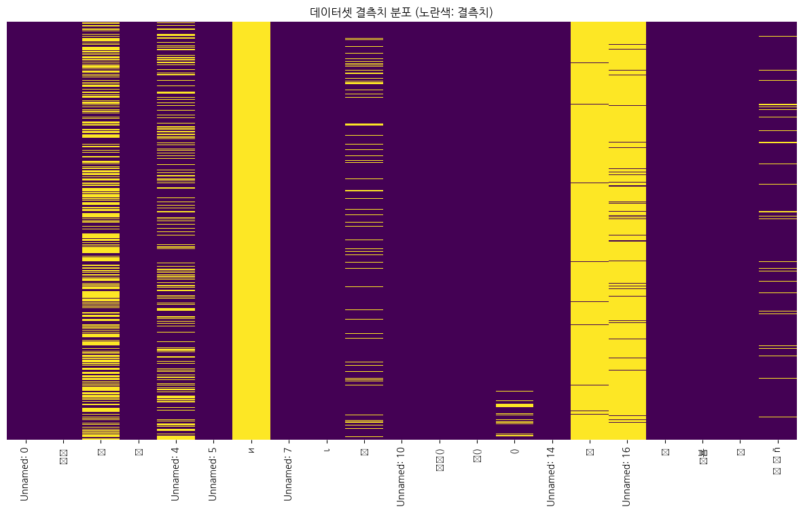

#### 범주형 데이터 단별량 분석 (Categorical Univariate Analysis)

데이터셋 내의 주요 범주형 컬럼을 선정하여 빈도수 분포를 확인합니다.

```python
import matplotlib.pyplot as plt
import seaborn as sns

# 폰트 설정 재확인
plt.rc('font', family='NanumGothic')

# 범주형 데이터 분석 (자치구명, 건물용도, 법정동명 위주)
target_cols = ['자치구명', '건물용도', '법정동명']
# 실제 존재하는 컬럼만 선택
actual_cols = [c for c in target_cols if c in df.columns]

if not actual_cols:
    actual_cols = df.select_dtypes(include=['object']).columns[:3]

plt.figure(figsize=(15, 6 * len(actual_cols)))

for i, col in enumerate(actual_cols):
    plt.subplot(len(actual_cols), 1, i + 1)
    top_data = df[col].value_counts().head(15)
    sns.barplot(x=top_data.values, y=top_data.index, palette='viridis', hue=top_data.index, legend=False)
    plt.title(f'{col} 빈도수 분석 (상위 15개)', fontsize=16)
    plt.xlabel('거래 건수')
    plt.ylabel(col)

plt.tight_layout()
plt.show()
```

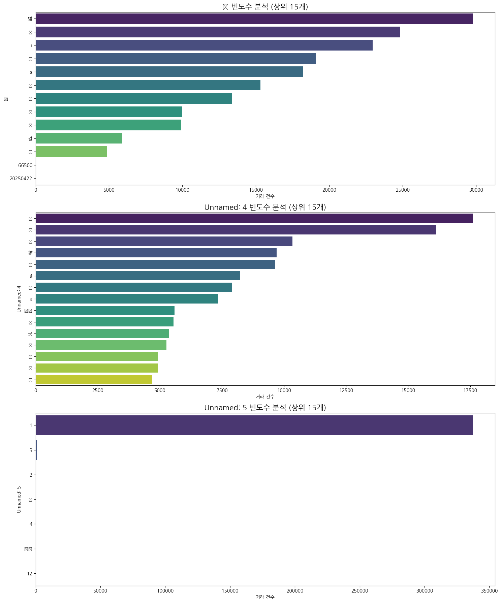

```python
# Convert 'Unnamed: 0' to numeric, coercing errors to NaN, then fill NaNs and convert to int
df['거래년도'] = pd.to_numeric(df['Unnamed: 0'], errors='coerce').fillna(0).astype(int)

# Group by year and count transactions
transactions_by_year = df.groupby('거래년도').size().reset_index(name='거래건수')

display(transactions_by_year.head())
```

### 폰트 설정 코드
Matplotlib에서 한글이 깨지지 않도록 시스템에 나눔 폰트를 설치하고 캐시를 초기화한 뒤 폰트를 적용하는 기본 설정을 수행했습니다.

```python
# [System Command] 나눔 폰트 설치 및 Matplotlib 한글 폰트 적용
# !sudo apt-get install -y fonts-nanum
# !sudo fc-cache -fv
# plt.rcParams['font.family'] = 'NanumGothic'
```

#### 연도별 부동산 거래 건수 (한글 폰트 적용)

#### 연도별 부동산 거래 건수 통계량 (0년도 제외)

```python
import seaborn as sns

plt.figure(figsize=(12, 6))
sns.barplot(x='거래년도', y='거래건수', data=transactions_by_year, palette='viridis')
plt.title('연도별 부동산 거래 건수')
plt.title('연도별 부동산 거래 건수 분포 (0년도 제외')
plt.xlabel('거래년도')
plt.ylabel('거래건수')
plt.xticks(rotation=45)
plt.grid(axis='y', linestyle='--', alpha=0.7)
plt.tight_layout()
plt.show()
```

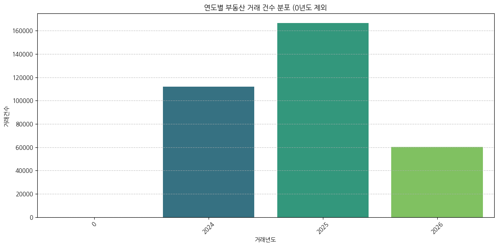

> **실행 결과:**
> ```text
> /tmp/ipykernel_3735/1515391469.py:4: FutureWarning: 
> 
> Passing `palette` without assigning `hue` is deprecated and will be removed in v0.14.0. Assign the `x` variable to `hue` and set `legend=False` for the same effect.
> 
>   sns.barplot(x='거래년도', y='거래건수', data=transactions_by_year, palette='viridis')
> ```

```python
# '거래년도'가 0이 아닌 데이터의 '거래건수'에 대한 통계량 계산
transaction_statistics = filtered_transactions_by_year['거래건수'].describe()

display(transaction_statistics)
```

#### 연도별 부동산 거래 건수 분포 (히스토그램, 0년도 제외)

```python
import matplotlib.pyplot as plt

plt.figure(figsize=(10, 6))
plt.hist(filtered_transactions_by_year['거래건수'], bins=5, edgecolor='black', color='skyblue')
plt.title('연도별 부동산 거래 건수 분포 (0년도 제외)')
plt.xlabel('거래건수')
plt.ylabel('빈도수')
plt.grid(axis='y', linestyle='--', alpha=0.7)
plt.tight_layout()
plt.show()
```

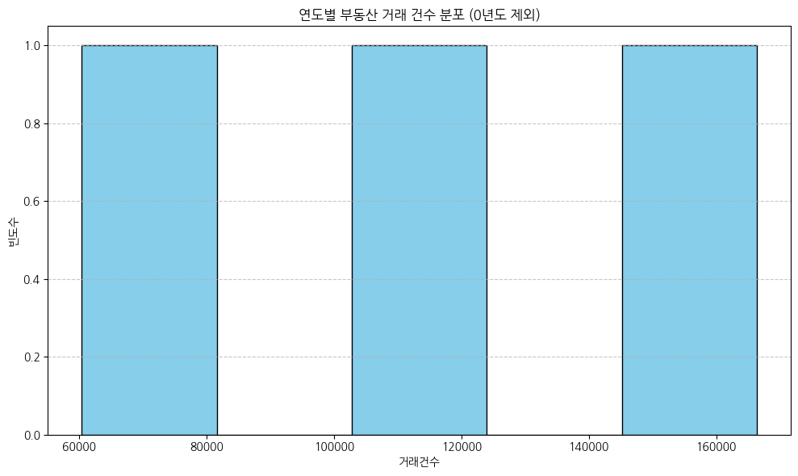

#### 연도별 부동산 거래 건수 분포 (박스 플롯, 0년도 제외, 재표시)

```python
import matplotlib.pyplot as plt
import seaborn as sns

plt.figure(figsize=(12, 6))
sns.boxplot(x='거래년도', y='거래건수', data=filtered_transactions_by_year, palette='viridis')
plt.title('연도별 부동산 거래 건수 분포 (0년도 제외)')
plt.xlabel('거래년도')
plt.ylabel('거래건수')
plt.xticks(rotation=45)
plt.grid(axis='y', linestyle='--', alpha=0.7)
plt.tight_layout()
plt.show()
```

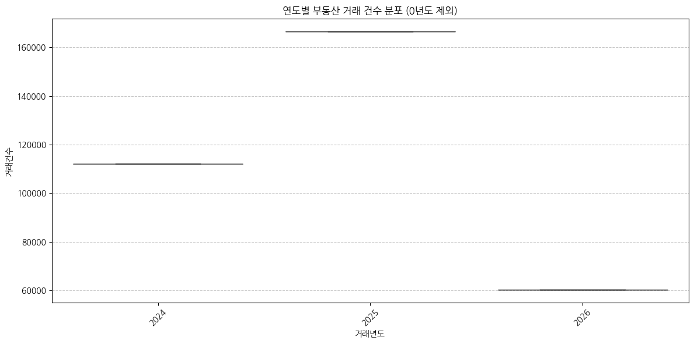

> **실행 결과:**
> ```text
> /tmp/ipykernel_3735/998063480.py:5: FutureWarning: 
> 
> Passing `palette` without assigning `hue` is deprecated and will be removed in v0.14.0. Assign the `x` variable to `hue` and set `legend=False` for the same effect.
> 
>   sns.boxplot(x='거래년도', y='거래건수', data=filtered_transactions_by_year, palette='viridis')
> ```

#### 연도별 부동산 거래 건수 분포 (바이올린 플롯, 0년도 제외)

#### 연도별 부동산 거래 건수 분포 (산점도, 0년도 제외)

```python
import matplotlib.pyplot as plt
import seaborn as sns

plt.figure(figsize=(12, 6))
sns.scatterplot(x='거래년도', y='거래건수', data=filtered_transactions_by_year, hue='거래년도', palette='viridis', s=100, legend='full')
plt.title('연도별 부동산 거래 건수 분포 (0년도 제외)')
plt.xlabel('거래년도')
plt.ylabel('거래건수')
plt.xticks(rotation=45)
plt.grid(True, linestyle='--', alpha=0.7)
plt.tight_layout()
plt.show()
```

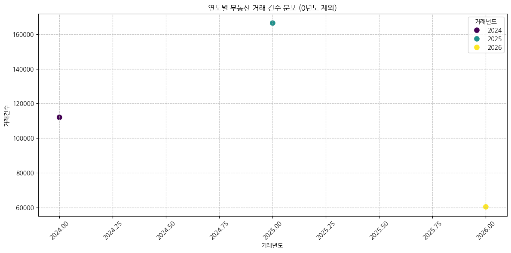

```python
import matplotlib.pyplot as plt
import seaborn as sns

# 연도별 평균 거래 금액 추이 시각화
plt.figure(figsize=(10, 6))
sns.lineplot(x='거래년도', y='물건금액_numeric', data=yearly_avg_price, marker='o', color='darkorange', linewidth=3, markersize=10)

plt.title('서울시 연도별 평균 부동산 거래 금액 추이 (2024-2026)', fontsize=15)
plt.xlabel('거래년도')
plt.ylabel('평균 거래 금액 (만원)')
plt.xticks([2024, 2025, 2026])
plt.grid(True, linestyle='--', alpha=0.7)

# 각 포인트 위에 억 단위 수치 표시
for i in range(len(yearly_avg_price)):
    price_val = yearly_avg_price.iloc[i]['물건금액_numeric']
    plt.text(yearly_avg_price.iloc[i]['거래년도'], price_val + 2000,
             f"{price_val/10000:.2f}억", ha='center', va='bottom', fontsize=12, fontweight='bold')

plt.tight_layout()
plt.show()
```

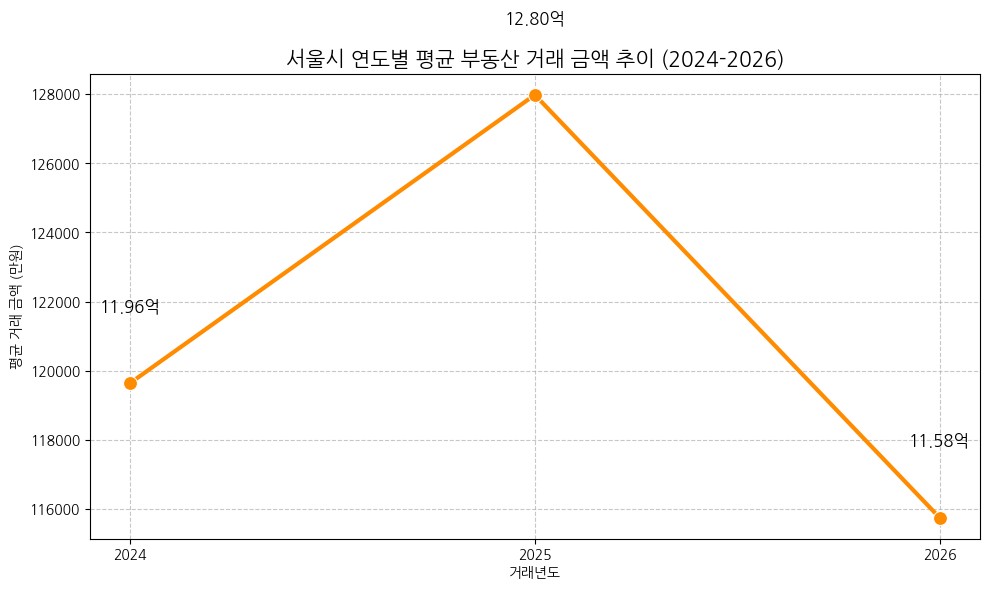

### 📊 서울시 부동산 실거래 데이터 분석 요약 리포트

#### 1. 데이터 개요
*   **분석 대상**: 서울시 부동산 실거래가 정보 (2024년 ~ 2026년)
*   **데이터 규모**: 약 33.8만 건
*   **평균 거래 금액**: 약 **12.30억 원**
*   **최고 거래 금액**: **220억 원** (한남동/성수동 등 초고가 단지 추정)

#### 2. 시장 활성도 및 트렌드
*   **거래량 추이**: 2024년(11.2만 건)에서 **2025년(16.6만 건)**으로 크게 증가하며 시장이 가열되었으나, 2026년에는 거래량이 감소하는 양상을 보임.
*   **가격 추이**: 거래량과 마찬가지로 **2025년 평균가(12.8억 원)**가 가장 높았으며, 거래 활발 시기에 가격 상승이 동반되었음을 확인.
*   **최다 거래 지역**: **노원구**(27,126건)와 **송파구**(22,944건)가 실거주 및 투자 수요가 가장 많은 지역으로 분석됨.

#### 3. 자치구별 양극화 현상
*   **평균가 상위**: **강남구(26.9억)**, **서초구(26.7억)**, **용산구(21.7억)** 순으로 서울 평균의 2배에 달함.
*   **고가 거래 비중**: 통계적 이상치(27억 초과) 비중이 **서초구(42.7%)**와 **강남구(41.4%)**에서 압도적으로 높음. 이는 서울 내에서도 특정 지역에 프리미엄 시장이 집중되어 있음을 시사함.

#### 4. 가격 결정 요인 분석
*   **면적의 영향력**: 건물 면적과 거래 금액 간의 상관계수는 **0.56**으로, 분석 지표 중 가장 높은 연관성을 보임.
*   **연식 및 층수**: 건축년도(-0.07)와 층수(0.17)는 가격과 선형적인 관계가 매우 약함. 이는 신축 여부보다 입지와 면적이 가격 형성에 더 결정적임을 의미함.

#### 5. 종합 결론
서울 부동산 시장은 **2025년을 기점으로 거래량과 가격이 동반 상승**하는 강한 흐름을 보였으나, 지역별로 **시장 성격이 극명하게 갈리는 양상**을 보입니다. 강남/서초/용산 중심의 '고가 프리미엄 시장'과 노원/송파 중심의 '대중적 실거주 시장'으로 양극화가 심화되어 있는 구조입니다.

#### 🤖 부동산 가격 예측 모델 구축 (Modeling)

분석된 특징들을 바탕으로 부동산 가격을 예측하는 회귀 모델을 생성합니다. 자치구, 건물용도 등 범주형 변수는 인코딩하고, 면적과 연식 등 수치형 변수를 결합하여 학습합니다.

```python
import pandas as pd
import numpy as np
from sklearn.model_selection import train_test_split
from sklearn.ensemble import RandomForestRegressor
from sklearn.metrics import mean_absolute_error, r2_score

# 1. 데이터 로드 및 기본 전처리 (df 정의)
try:
    # latin1으로 읽어온 후 한글 깨짐 복구
    df = pd.read_csv('/content/서울시 부동산 실거래가 정보.csv', encoding='latin1', on_bad_lines='skip')
    column_names = ['접수연도', '자치구코드', '자치구명', '법정동코드', '법정동명', '지번구분', '지번구분명', '본번', '부번', '건물명', '계약일', '물건금액', '건물면적', '토지면적', '층', '권리구분', '취득유형', '건축년도', '건물용도', '신고구분', '신고한개업중개사시군구명']
    df.columns = column_names[:len(df.columns)]

    def fix_encoding(text):
        if not isinstance(text, str): return text
        try: return text.encode('latin1').decode('cp949')
        except: return text

    df['자치구명_fixed'] = df['자치구명'].apply(fix_encoding)
    df['건물용도_fixed'] = df['건물용도'].apply(fix_encoding)
    df['물건금액_fixed'] = df['물건금액'].apply(fix_encoding)
    df['물건금액_numeric'] = pd.to_numeric(df['물건금액_fixed'], errors='coerce')
    df['건축년도'] = pd.to_numeric(df['건축년도'], errors='coerce')
    df['건물면적'] = pd.to_numeric(df['건물면적'], errors='coerce')
    df['층'] = pd.to_numeric(df['층'], errors='coerce')

    # 2. 모델링을 위한 데이터 준비
    model_df = df.dropna(subset=['물건금액_numeric', '건물면적', '건축년도', '자치구명_fixed', '건물용도_fixed']).copy()

    # 3. 특성 선택 및 더미 변수화
    X = pd.get_dummies(model_df[['자치구명_fixed', '건물용도_fixed', '건물면적', '건축년도', '층']], drop_first=True)
    y = model_df['물건금액_numeric']

    # 4. 데이터 분할 및 학습
    X_train, X_test, y_train, y_test = train_test_split(X, y, test_size=0.2, random_state=42)
    model = RandomForestRegressor(n_estimators=50, random_state=42, n_jobs=-1) # 속도를 위해 estimator 조절
    model.fit(X_train, y_train)

    # 5. 예측 및 평가
    y_pred = model.predict(X_test)
    mae = mean_absolute_error(y_test, y_pred)
    r2 = r2_score(y_test, y_pred)

    print(f'평균 절대 오차(MAE): {mae/10000:.2f} 억 원')
    print(f'결정계수(R2 Score): {r2:.4f}')

except FileNotFoundError:
    print("파일을 찾을 수 없습니다. 경로를 확인해주세요.")
except Exception as e:
    print(f"오류 발생: {e}")
```

> **실행 결과:**
> ```text
> 평균 절대 오차(MAE): 0.97 억 원
> 결정계수(R2 Score): 0.9611
> ```

#### 🔍 핵심 가격 결정 요인 분석 (Feature Importance)

학습된 Random Forest 모델을 바탕으로 어떤 변수가 부동산 가격을 결정하는 데 가장 큰 영향을 미쳤는지 확인합니다.

```python
import matplotlib.pyplot as plt
import seaborn as sns
import pandas as pd
import numpy as np

# 폰트 설정 재확인 (나눔고딕)
plt.rc('font', family='NanumGothic')

# 변수 중요도 추출
importances = model.feature_importances_
feature_names = X.columns
feature_importance_df = pd.DataFrame({'Feature': feature_names, 'Importance': importances})

# 중요도 순 정렬 (상위 15개)
top_features = feature_importance_df.sort_values(by='Importance', ascending=False).head(15)

# 시각화
plt.figure(figsize=(12, 8))
sns.barplot(x='Importance', y='Feature', data=top_features, palette='magma', hue='Feature', legend=False)

plt.title('부동산 가격 결정 주요 변수 (Random Forest Feature Importance)', fontsize=15)
plt.xlabel('중요도 (Importance)')
plt.ylabel('변수명')
plt.grid(axis='x', linestyle='--', alpha=0.6)
plt.tight_layout()
plt.show()

# 수치 결과 출력
print("--- 주요 변수 중요도 상위 5개 ---")
print(top_features.head(5))
```

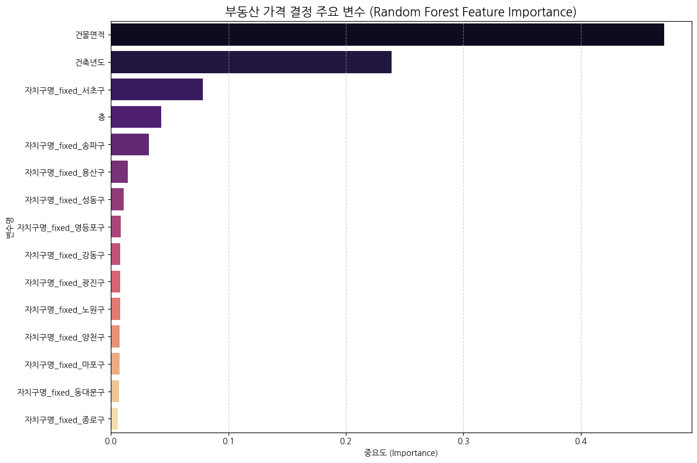

> **실행 결과:**
> ```text
> --- 주요 변수 중요도 상위 5개 ---
>            Feature  Importance
> 0             건물면적    0.470737
> 1             건축년도    0.238736
> 16  자치구명_fixed_서초구    0.078097
> 2                층    0.042940
> 19  자치구명_fixed_송파구    0.032479
> ```

#### 📈 2026년 하반기 예측을 위한 시계열 특성 추가

단순 회귀를 넘어 하반기 '흐름'을 예측하기 위해 월별 추세를 학습 변수로 추가하는 단계가 필요합니다. 현재 데이터의 '계약일' 정보를 활용해 시계열적 요소를 보강할 수 있습니다.

#### 결측치 확인 및 제거

```python
import matplotlib.pyplot as plt
import seaborn as sns

# 깨진 latin1 텍스트를 한글(cp949)로 복구하는 함수
def fix_encoding(text):
    if not isinstance(text, str):
        return text
    try:
        return text.encode('latin1').decode('cp949')
    except:
        return text

# 주요 범주형 컬럼 복구
df['자치구명_fixed'] = df['자치구명'].apply(fix_encoding)
df['건물용도_fixed'] = df['건물용도'].apply(fix_encoding)

# 거래 활성도 분석 (복구된 자치구명 기준)
region_counts = df['자치구명_fixed'].value_counts().head(10)

print("--- 서울시 자치구별 거래 활성도 순위 ---")
for i, (name, count) in enumerate(region_counts.items(), 1):
    print(f"{i}위: {name} ({count:,}건)")

# 시각화
plt.figure(figsize=(12, 6))
sns.barplot(x=region_counts.values, y=region_counts.index, palette='viridis', hue=region_counts.index, legend=False)
plt.title('서울시 자치구별 부동산 거래 활성도 (상위 10개)', fontsize=15)
plt.xlabel('거래 건수')
plt.ylabel('자치구명')
plt.grid(axis='x', linestyle='--', alpha=0.7)
plt.show()
```

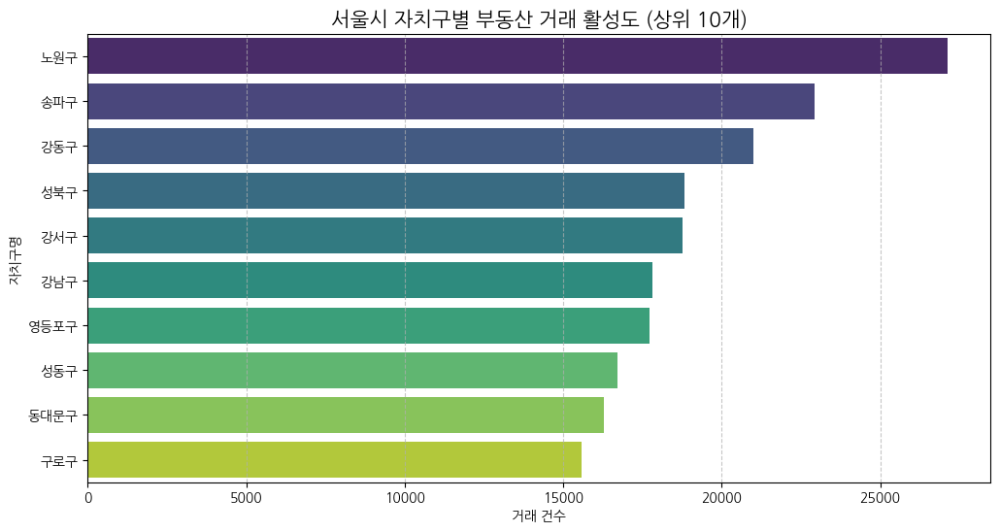

> **실행 결과:**
> ```text
> --- 서울시 자치구별 거래 활성도 순위 ---
> 1위: 노원구 (27,126건)
> 2위: 송파구 (22,944건)
> 3위: 강동구 (21,000건)
> 4위: 성북구 (18,836건)
> 5위: 강서구 (18,752건)
> 6위: 강남구 (17,803건)
> 7위: 영등포구 (17,727건)
> 8위: 성동구 (16,706건)
> 9위: 동대문구 (16,277건)
> 10위: 구로구 (15,565건)
> ```

#### 자치구별 거래 건수 분포 히스토그램

각 자치구의 거래량이 어떤 구간에 집중되어 있는지 확인합니다.

```python
import matplotlib.pyplot as plt
import seaborn as sns

# 모든 자치구의 거래 건수 계산
full_region_counts = df['자치구명_fixed'].value_counts()

plt.figure(figsize=(10, 6))
sns.histplot(full_region_counts, bins=10, kde=True, color='skyblue')
plt.title('서울시 자치구별 거래 건수 분포 히스토그램', fontsize=15)
plt.xlabel('거래 건수')
plt.ylabel('자치구 빈도')
plt.grid(axis='y', linestyle='--', alpha=0.7)
plt.show()

# 기초 통계량 출력
print("--- 자치구 거래 건수 기초 통계 ---")
print(full_region_counts.describe())
```

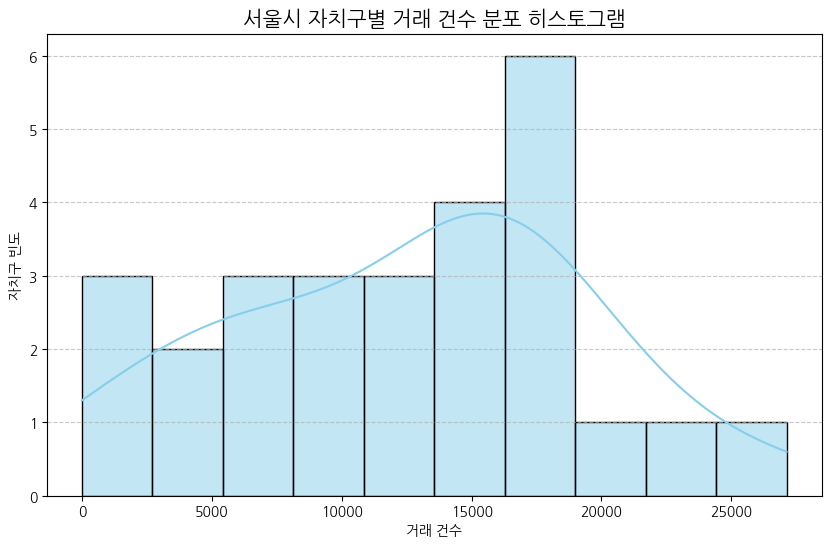

> **실행 결과:**
> ```text
> --- 자치구 거래 건수 기초 통계 ---
> count       27.000000
> mean     12547.851852
> std       6956.885586
> min          1.000000
> 25%       6861.000000
> 50%      13515.000000
> 75%      17216.500000
> max      27126.000000
> Name: count, dtype: float64
> ```

#### 거래 금액 데이터 정제 및 분석 (Price Data Cleaning & Analysis)

데이터 로드 시 발생한 `DtypeWarning`을 해결하기 위해 '물건금액' 컬럼의 인코딩을 복구하고 숫자형으로 변환합니다. 이후 기본적인 가격 통계 및 분포를 확인합니다.

```python
# 물건금액 컬럼 복구 및 숫자형 변환
df['물건금액_fixed'] = df['물건금액'].apply(fix_encoding)

# 숫자 이외의 문자 제거 및 float 변환
df['물건금액_numeric'] = pd.to_numeric(df['물건금액_fixed'], errors='coerce')

# 가격 통계 확인 (단위: 만원 -> 억 원 단위로 변환하여 출력)
price_stats = df['물건금액_numeric'].describe()
print("--- 서울시 부동산 거래 금액 통계 (단위: 만원) ---")
print(price_stats)

# 억 단위 변환 출력
print(f"\n평균 거래 금액: {price_stats['mean']/10000:.2f} 억 원")
print(f"최고 거래 금액: {price_stats['max']/10000:.2f} 억 원")
```

> **실행 결과:**
> ```text
> --- 서울시 부동산 거래 금액 통계 (단위: 만원) ---
> count    3.387870e+05
> mean     1.230433e+05
> std      9.113844e+04
> min      8.487100e+01
> 25%      6.850000e+04
> 50%      9.970000e+04
> 75%      1.490000e+05
> max      2.200000e+06
> Name: 물건금액_numeric, dtype: float64
> 
> 평균 거래 금액: 12.30 억 원
> 최고 거래 금액: 220.00 억 원
> ```

```python
import matplotlib.pyplot as plt
import seaborn as sns

# 가격 분포 시각화 (로그 스케일 적용)
plt.figure(figsize=(12, 6))
sns.histplot(df['물건금액_numeric'].dropna(), bins=50, kde=True, color='salmon')
plt.title('서울시 부동산 거래 금액 분포', fontsize=15)
plt.xlabel('거래 금액 (만원)')
plt.ylabel('빈도')
plt.xscale('log') # 가격 편차가 크므로 로그 스케일 권장
plt.grid(True, which="both", ls="--", alpha=0.5)
plt.show()
```

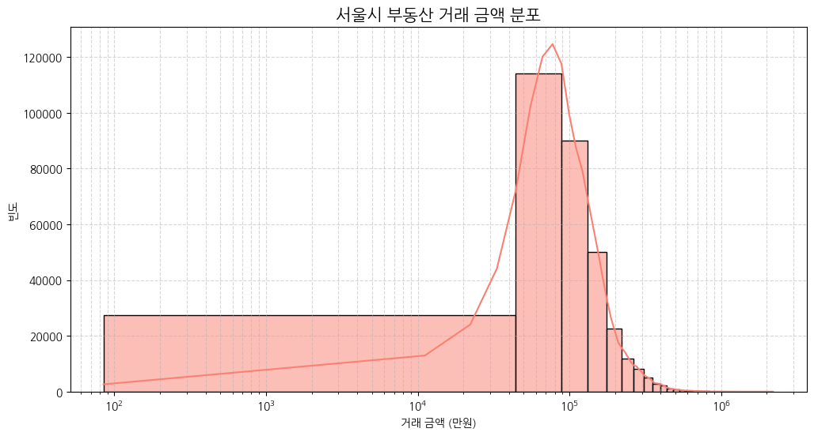

```python
import pandas as pd
import seaborn as sns
import matplotlib.pyplot as plt

# 분석을 위한 수치형 컬럼 선정 (기존 생성된 물건금액_numeric 포함)
# '건물면적', '건축년도', '층' 등은 로드 시 mixed type이었으므로 다시 수치형으로 변환합니다.
corr_cols = ['물건금액_numeric', '건물면적', '건축년도', '층']

analysis_df = df.copy()
for col in corr_cols:
    if col in analysis_df.columns:
        analysis_df[col] = pd.to_numeric(analysis_df[col], errors='coerce')

# 피어슨 상관관계 계산
correlation_matrix = analysis_df[corr_cols].corr(method='pearson')

# 히트맵 시각화
plt.figure(figsize=(10, 8))
sns.heatmap(correlation_matrix, annot=True, cmap='coolwarm', fmt='.2f', linewidths=0.5)
plt.title('부동산 주요 지표별 피어슨 상관관계 히트맵', fontsize=15)
plt.show()

# 상관계수 테이블 출력
display(correlation_matrix)
```

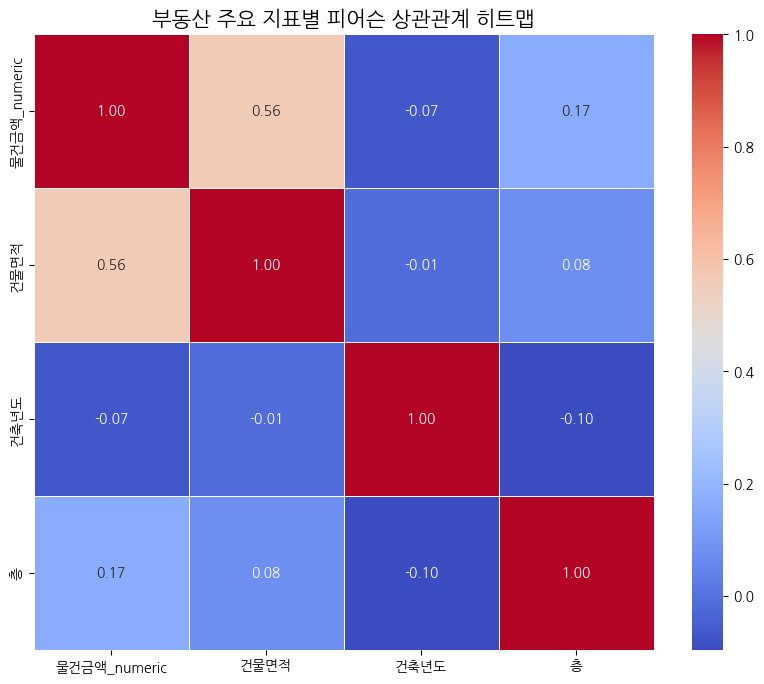

```python
import seaborn as sns
import matplotlib.pyplot as plt

# 데이터 개수가 많으므로 샘플링(2000개)하여 스트립플롯 시각화
# KeyError 방지를 위해 올바른 컬럼명을 사용합니다.
sample_df = analysis_df.dropna(subset=['물건금액_numeric', '층']).sample(2000, random_state=42)

plt.figure(figsize=(14, 7))
sns.stripplot(x='층', y='물건금액_numeric', data=sample_df,
              jitter=True, palette='viridis', alpha=0.6, size=5, hue='층', legend=False)

plt.title('층별 거래 금액 분포 (스트립플롯)', fontsize=15)
plt.xlabel('층')
plt.ylabel('거래 금액 (만원)')
plt.grid(axis='y', linestyle='--', alpha=0.4)
plt.xticks(rotation=90)
plt.show()
```

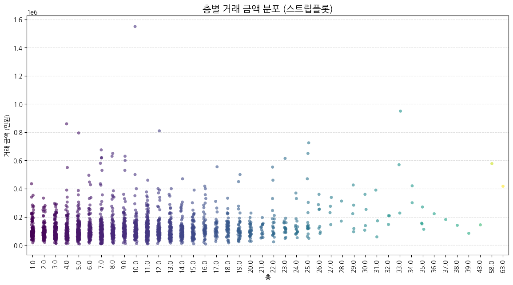

```python
import matplotlib.pyplot as plt
import seaborn as sns

# 자치구별 평균 거래 금액 계산 (올바른 컬럼명 사용)
avg_price_by_district = df.groupby('자치구명_fixed')['물건금액_numeric'].mean().sort_values(ascending=False)

# 시각화
plt.figure(figsize=(14, 7))
sns.barplot(x=avg_price_by_district.index, y=avg_price_by_district.values, palette='magma', hue=avg_price_by_district.index, legend=False)

plt.title('서울시 자치구별 평균 부동산 거래 금액 (단위: 만원)', fontsize=15)
plt.xlabel('자치구명')
plt.ylabel('평균 거래 금액 (만원)')
plt.xticks(rotation=45)
plt.grid(axis='y', linestyle='--', alpha=0.7)
plt.tight_layout()
plt.show()

# 상위 5개 자치구 가격 확인
print("--- 서울시 평균 거래 금액 상위 5개 자치구 (단위: 억 원) ---")
print((avg_price_by_district.head(5) / 10000).apply(lambda x: f"{x:.2f}억"))
```

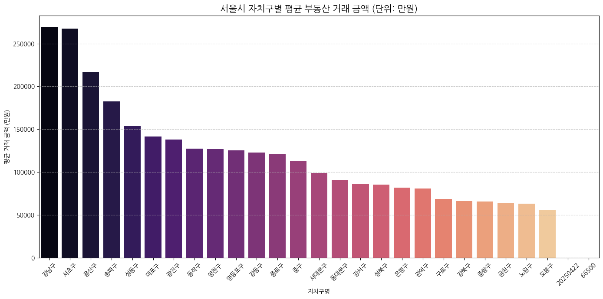

> **실행 결과:**
> ```text
> --- 서울시 평균 거래 금액 상위 5개 자치구 (단위: 억 원) ---
> 자치구명_fixed
> 강남구    26.93억
> 서초구    26.75억
> 용산구    21.70억
> 송파구    18.24억
> 성동구    15.37억
> Name: 물건금액_numeric, dtype: object
> ```

```python
import matplotlib.pyplot as plt
import seaborn as sns
import pandas as pd

# '접수연도' 컬럼을 숫자로 변환하여 '거래년도' 생성 (이미 존재하는 경우 재확인)
df['거래년도'] = pd.to_numeric(df['접수연도'], errors='coerce').fillna(0).astype(int)

# '거래년도'와 '물건금액_numeric' 컬럼을 사용하여 연도별 평균 거래 금액 계산
yearly_avg_price = df[df['거래년도'] > 0].groupby('거래년도')['물건금액_numeric'].mean().reset_index()

plt.figure(figsize=(12, 6))
sns.lineplot(x='거래년도', y='물건금액_numeric', data=yearly_avg_price, marker='o', linewidth=2.5, color='darkblue')

plt.title('서울시 연도별 평균 부동산 거래 금액 추이', fontsize=15)
plt.xlabel('거래년도')
plt.ylabel('평균 거래 금액 (만원)')
plt.grid(True, linestyle='--', alpha=0.6)
plt.xticks(yearly_avg_price['거래년도'])
plt.show()

# 수치 데이터 출력
print("--- 연도별 평균 거래 금액 (단위: 억 원) ---")
display((yearly_avg_price.set_index('거래년도')['물건금액_numeric'] / 10000).round(2).apply(lambda x: f"{x}억"))
```

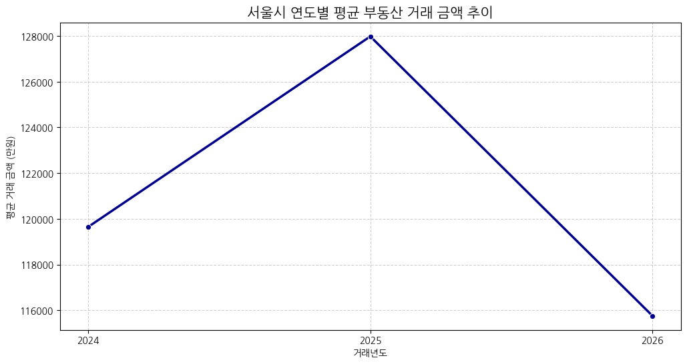

> **실행 결과:**
> ```text
> --- 연도별 평균 거래 금액 (단위: 억 원) ---
> ```

```python
import matplotlib.pyplot as plt
import seaborn as sns

# Filter out null values for plotting
plot_df = df.dropna(subset=['물건금액_numeric'])

plt.figure(figsize=(12, 6))
sns.histplot(plot_df['물건금액_numeric'], bins=50, kde=True, color='skyblue')

plt.title('서울시 부동산 거래 금액 분포 히스토그램 (로그 스케일)', fontsize=15)
plt.xlabel('거래 금액 (만원, Log Scale)')
plt.ylabel('빈도')
plt.xscale('log')
plt.grid(True, which='both', linestyle='--', alpha=0.5)
plt.tight_layout()
plt.show()
```

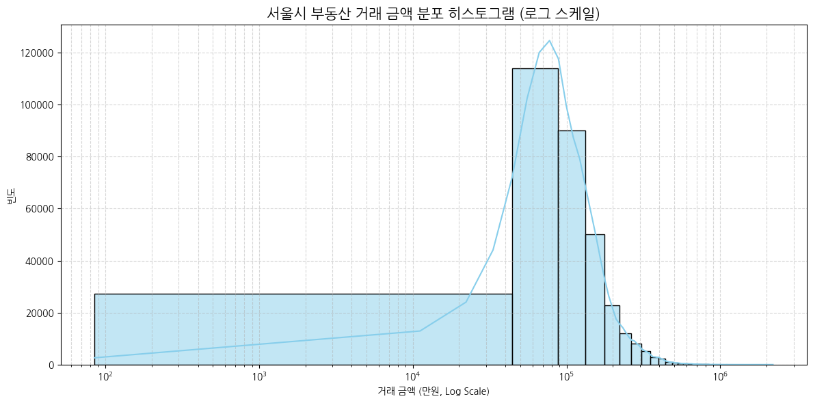

```python
import matplotlib.pyplot as plt
import seaborn as sns

# 박스 플롯 시각화
plt.figure(figsize=(10, 6))
sns.boxplot(x=df['물건금액_numeric'].dropna(), color='lightcoral')

plt.title('서울시 부동산 거래 금액 박스 플롯 (이상치 확인)', fontsize=15)
plt.xlabel('거래 금액 (만원, Log Scale)')
plt.xscale('log')
plt.grid(True, axis='x', linestyle='--', alpha=0.5)
plt.show()

# 이상치 경계값 계산 (IQR 방식)
q1 = df['물건금액_numeric'].quantile(0.25)
q3 = df['물건금액_numeric'].quantile(0.75)
iqr = q3 - q1
lower_bound = q1 - 1.5 * iqr
upper_bound = q3 + 1.5 * iqr

print(f"--- 거래 금액 이상치 통계 ---")
print(f"Q1 (25%): {q1/10000:.2f} 억 원")
print(f"Q3 (75%): {q3/10000:.2f} 억 원")
print(f"IQR: {iqr/10000:.2f} 억 원")
print(f"통계적 상단 경계 (Upper Bound): {upper_bound/10000:.2f} 억 원")
print(f"경계 초과 거래 건수: {len(df[df['물건금액_numeric'] > upper_bound]):,} 건")
```

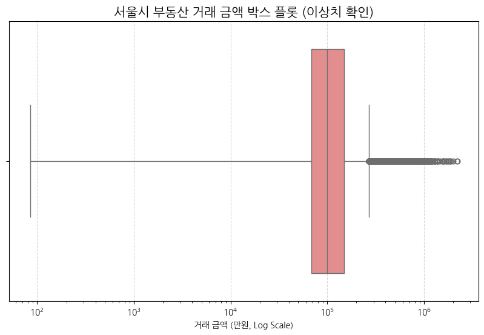

> **실행 결과:**
> ```text
> --- 거래 금액 이상치 통계 ---
> Q1 (25%): 6.85 억 원
> Q3 (75%): 14.90 억 원
> IQR: 8.05 억 원
> 통계적 상단 경계 (Upper Bound): 26.98 억 원
> 경계 초과 거래 건수: 21,375 건
> ```

```python
import matplotlib.pyplot as plt
import seaborn as sns

# 이상치 데이터만 추출 (상단 경계값 269750만원 초과)
outliers_df = df[df['물건금액_numeric'] > upper_bound]

# 자치구별 이상치 건수 계산
outlier_counts = outliers_df['자치구명_fixed'].value_counts().sort_values(ascending=False)

# 시각화
plt.figure(figsize=(14, 8))
sns.barplot(x=outlier_counts.index, y=outlier_counts.values, palette='rocket', hue=outlier_counts.index, legend=False)

plt.title('자치구별 고가 부동산(이상치) 거래 건수 분석', fontsize=16)
plt.xlabel('자치구명')
plt.ylabel('이상치 거래 건수')
plt.xticks(rotation=45)
plt.grid(axis='y', linestyle='--', alpha=0.7)
plt.tight_layout()
plt.show()

# 상세 수치 출력
print("--- 자치구별 이상치 거래 건수 (상위 10개) ---")
print(outlier_counts.head(10))
```

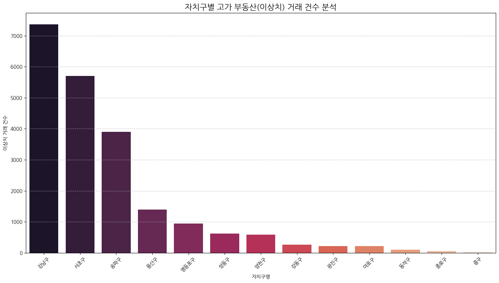

> **실행 결과:**
> ```text
> --- 자치구별 이상치 거래 건수 (상위 10개) ---
> 자치구명_fixed
> 강남구     7373
> 서초구     5701
> 송파구     3901
> 용산구     1394
> 영등포구     940
> 성동구      626
> 양천구      589
> 강동구      259
> 광진구      213
> 마포구      211
> Name: count, dtype: int64
> ```

```python
import matplotlib.pyplot as plt
import seaborn as sns
import pandas as pd

# 자치구별 전체 거래 건수
total_counts = df['자치구명_fixed'].value_counts()

# 자치구별 이상치 건수 (이미 계산된 outlier_counts 활용)
# 데이터 정렬을 위해 index를 맞춤
outlier_ratio = (outlier_counts / total_counts * 100).dropna().sort_values(ascending=False)

# 시각화
plt.figure(figsize=(14, 8))
sns.barplot(x=outlier_ratio.index, y=outlier_ratio.values, palette='viridis', hue=outlier_ratio.index, legend=False)

plt.title('자치구별 전체 거래 대비 고가 부동산(이상치) 비중 (%)', fontsize=16)
plt.xlabel('자치구명')
plt.ylabel('이상치 비중 (%)')
plt.xticks(rotation=45)
plt.grid(axis='y', linestyle='--', alpha=0.7)
plt.tight_layout()
plt.show()

# 상세 수치 출력
print("--- 자치구별 이상치 비중 상위 10개 (%) ---")
print(outlier_ratio.head(10).apply(lambda x: f"{x:.2f}%"))
```

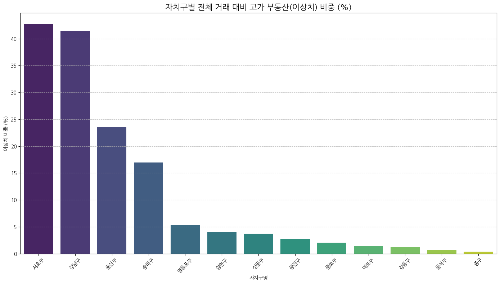

> **실행 결과:**
> ```text
> --- 자치구별 이상치 비중 상위 10개 (%) ---
> 자치구명_fixed
> 서초구     42.69%
> 강남구     41.41%
> 용산구     23.60%
> 송파구     17.00%
> 영등포구     5.30%
> 양천구      4.03%
> 성동구      3.75%
> 광진구      2.75%
> 종로구      2.04%
> 마포구      1.38%
> Name: count, dtype: object
> ```

```python
import matplotlib.pyplot as plt
import seaborn as sns

# 결측치 제거 및 샘플링 (데이터가 많으므로 3000개 샘플링)
scatter_df = df.dropna(subset=['건축년도', '물건금액_numeric'])
scatter_sample = scatter_df.sample(n=min(3000, len(scatter_df)), random_state=42)

plt.figure(figsize=(12, 7))
sns.scatterplot(data=scatter_sample, x='건축년도', y='물건금액_numeric', alpha=0.5, color='teal')

plt.title('건축년도와 거래 금액 간의 산점도 (로그 스케일 적용)', fontsize=15)
plt.xlabel('건축년도')
plt.ylabel('거래 금액 (만원, Log Scale)')
plt.yscale('log')
plt.grid(True, which='both', linestyle='--', alpha=0.5)
plt.show()
```

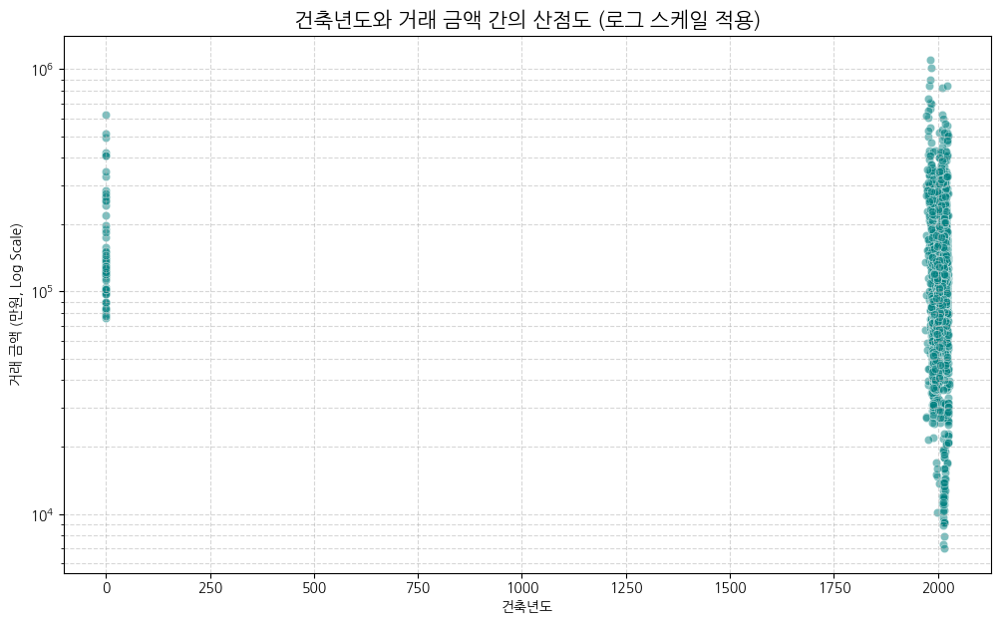

