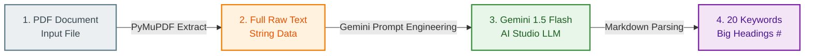

안녕하세요! 오늘은 Google AI Studio의 **Gemini API**와 파이썬의 **PyMuPDF** 라이브러리를 활용하여, 업로드된 PDF 파일의 텍스트를 자동으로 분석하고 가장 중요한 핵심 키워드 20개를 추출해 주는 앱 서비스 백엔드 구현 방법을 소개해 드립니다.

## 📊 PDF 키워드 요약 서비스 데이터 흐름도 (Data Pipeline)

실제 서비스에 적용하기 위해 데이터의 흐름을 명확히 분리(Decoupling)했습니다. 무거운 파서를 거치는 대신 가벼운 전처리 단계를 거쳐 AI 모델에 전달하는 효율적인 구조입니다.



1. **PDF File**: 사용자가 앱에 PDF 문서를 업로드합니다.
2. **PyMuPDF (fitz)**: 가볍고 빠른 `PyMuPDF`를 사용해 내부 텍스트 데이터를 순식간에 문자열(String)로 추출합니다.
3. **Gemini Prompt**: 추출한 텍스트를 프롬프트 엔지니어링 기법을 통해 가성비와 속도가 뛰어난 `gemini-1.5-flash` 모델에 전달합니다.
4. **Markdown Output**: AI가 핵심 단어 20개를 마크다운 제목 포맷(`# 단어`)으로 정형화하여 최종 앱 UI에 전달합니다.

---

## 💻 핵심 구현 코드

프론트엔드 UI 프레임워크(React, Flutter 등)의 마크다운 렌더러에 그대로 밀어 넣어 즉시 키워드 카드로 노출할 수 있도록 최적화된 코드입니다.

```python
import fitz  # PyMuPDF 라이브러리
import google.generativeai as genai

# 1. Google AI Studio에서 발급받은 API 키 설정
genai.configure(api_key="YOUR_GEMINI_API_KEY")

def extract_text_from_pdf(pdf_path):
    """PDF 파일 경로를 받아 텍스트를 파싱하는 함수"""
    doc = fitz.open(pdf_path)
    text = ""
    for page in doc:
        text += page.get_text()
    return text

def summarize_keywords_with_gemini(text):
    """Gemini API를 호출하여 큰 글자 제목 형태의 키워드 20개를 추출하는 함수"""
    # 가성비와 속도가 뛰어난 1.5-flash 모델 채택
    model = genai.GenerativeModel('gemini-1.5-flash')
    
    # 프롬프트 설계 (앱 서비스 배포를 위한 명확한 규칙 지정)
    prompt = f"""
    아래 제공된 텍스트를 정밀 분석해서 다음 조건에 맞게 요약본을 반환해줘:
    1. 본문의 핵심 주제와 맥락을 관통하는 중요 단어(키워드) 20개를 엄선할 것.
    2. 프론트엔드 UI 화면에서 강조될 수 있도록 각 단어는 마크다운 큰 글자 제목 포맷인 '# 키워드' 형태로 출력할 것.
    3. 서론이나 부가적인 설명 없이 오직 조건에 맞는 리스트 데이터 20개만 깔끔하게 출력할 것.

    [분석할 텍스트]
    {text[:10000]}  # 안전한 API Token 관리를 위해 앞부분 1만 자 커트
    """
    
    response = model.generate_content(prompt)
    return response.text

# 메인 실행 프로세스
if __name__ == "__main__":
    pdf_file_path = "sample_document.pdf"  # 분석할 PDF 파일명
    
    try:
        print("[진행] 1단계: PDF 텍스트 추출을 시작합니다...")
        raw_text = extract_text_from_pdf(pdf_file_path)
        
        print("[진행] 2단계: Google Gemini AI 분석 요청 중...")
        result_summary = summarize_keywords_with_gemini(raw_text)
        
        print("\n✨ [완료] UI 렌더링용 키워드 20선 ✨\n")
        print(result_summary)
        
    except Exception as e:
        print(f"❌ 에러가 발생했습니다: {e}")
```

---

## 💡 구현 팁 (Tips)

* **글자 수 제어**: 코드 내 `text[:10000]` 부분은 필요에 따라 조절할 수 있습니다. `gemini-1.5-flash` 모델은 최대 100만 토큰까지 수용하므로 매우 긴 논문도 통째로 넣는 것이 가능합니다.
* **배포 환경 보안**: 블로그 코드에 예시로 적힌 `"YOUR_GEMINI_API_KEY"`는 실제 운영 환경이나 깃허브(GitHub)에 올릴 때 반드시 `.env` 파일(환경 변수)로 관리해야 안전합니다.

이번 포스팅이 AI 모델을 활용한 자동화 파이프라인 구축에 도움이 되셨길 바랍니다!
