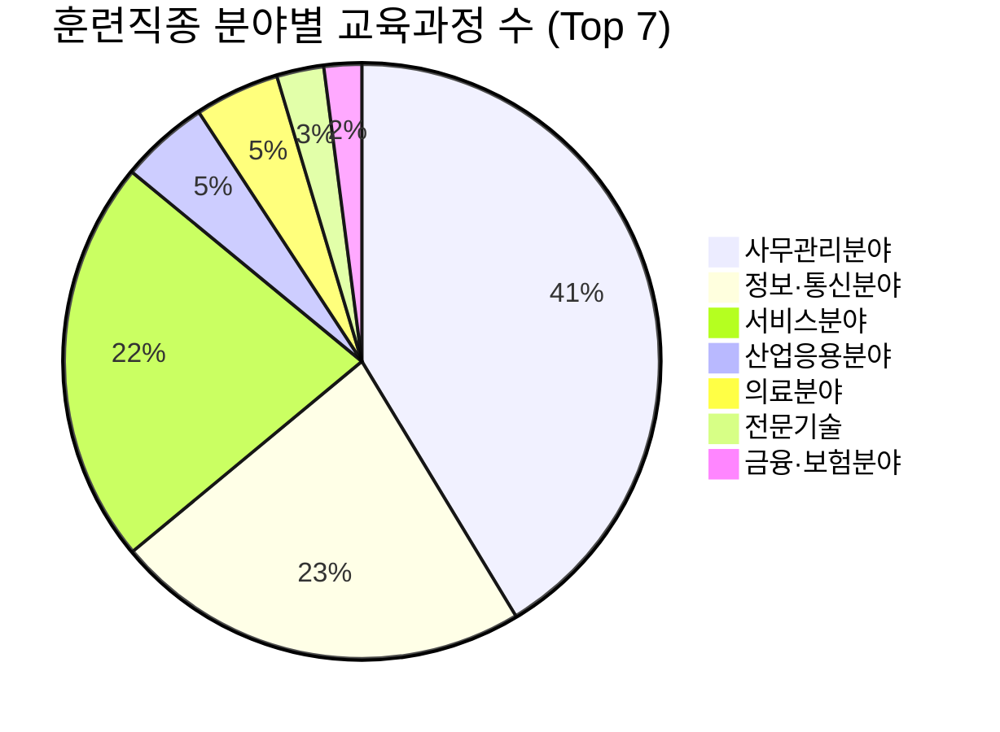

# 경기데이터드림: 경력단절 여성 취업지원 교육훈련 프로그램 분석 시각화

이전 포스팅에서 **경기데이터드림 Open API**를 활용하여 [경력단절 여성 취업지원 교육훈련 프로그램 현황] 데이터를 수집하고 `pandas`를 이용해 전처리 및 집계하는 과정을 살펴보았습니다.

오늘은 데이터를 바탕으로 도출된 핵심 집계 결과(`gg_career_job_large_count.csv`)를 시각화하여 인사이트를 확인해 보겠습니다.

## 📊 직종 분야별 교육과정 분포

전체 교육과정 중 어떤 직종 분야의 교육이 가장 활발하게 운영되고 있는지 한눈에 파악할 수 있는 차트입니다.

### 💡 주요 인사이트 (Insights)

1. **사무관리분야의 압도적 비중 (404건)**: 전체 교육 과정 중 사무관리분야가 가장 높은 비율을 차지하고 있습니다. 이는 취업 시장에서 사무 직군에 대한 꾸준한 수요와, 경력단절 후 재진입이 비교적 용이한 직무 특성이 반영된 결과로 해석됩니다.
2. **IT 및 서비스 분야의 강세**: 정보·통신분야(221건)와 서비스분야(215건)가 그 뒤를 잇고 있습니다. 특히 최근 디지털 트랜스포메이션의 흐름에 맞춰 정보통신 분야의 재교육 및 훈련 프로그램이 매우 활성화되어 있음을 알 수 있습니다.
3. **전문 직군 (의료, 금융/보험)**: 의료분야와 금융·보험분야와 같은 특정 자격이나 전문성이 강하게 요구되는 분야는 다소 비중이 낮지만, 여전히 유의미한 수의 훈련 프로그램이 운영되며 전문 인력을 양성하고 있습니다.

## 📌 요약 및 데이터 기반 데이터 활용 전략

데이터 수집 결과를 시각화해 본 결과, 공공기관 및 취업지원 센터에서는 수요가 높고 접근성이 좋은 **사무관리, IT/정보통신, 서비스** 분야에 집중적으로 교육 인프라를 투자하고 있다는 점을 발견했습니다.

이러한 오픈 데이터 시각화 결과는 향후 취업 준비생들이 **어떤 분야의 교육이 가장 활발하게 제공되는지 파악하고 진로를 결정하는 데 강력한 지표**로 활용될 수 있습니다. 

---
> 본 데이터는 경기데이터드림의 OpenAPI를 통해 직접 수집 및 정제된 데이터를 기반으로 분석되었습니다.
