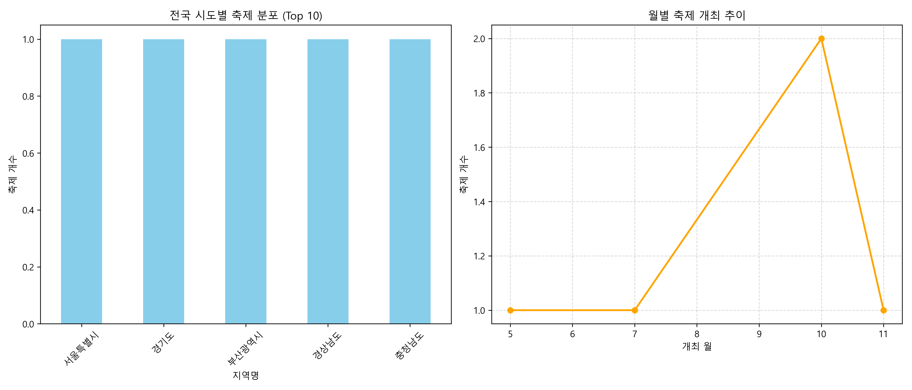

# 전국문화축제표준데이터 Open API EDA 실습

이번 포스팅에서는 공공데이터포털에서 제공하는 **전국문화축제표준데이터** Open API를 활용하여 데이터를 수집하고 분석하는 전체 과정을 정리해 봅니다. 단순히 API를 호출하는 것을 넘어, 응답받은 JSON 데이터를 `pandas` DataFrame으로 변환하고, 데이터 전처리 후 시각화(EDA)까지 진행하여 인사이트를 도출하는 것이 핵심입니다.

## 1. 분석 목표: 어느 지역에 축제가 가장 많을까?

전국 각지에서는 매년 지역의 문화, 예술, 역사, 특산물 등을 주제로 다양한 축제가 열립니다. 이번 분석의 주요 질문은 다음과 같습니다.
> **"전국 문화축제는 어느 지역에 가장 많이 분포되어 있는가?"**

## 2. API 호출 및 데이터 수집

공공데이터포털(data.go.kr)의 `전국문화축제표준데이터` API를 사용합니다. 
필요한 라이브러리는 `requests`, `pandas`, `math` 등입니다.

전체 데이터를 한 번에 가져올 수 없으므로, 먼저 1페이지를 호출하여 전체 데이터 개수(`totalCount`)를 확인한 뒤, 전체 페이지 수를 계산하여 반복문으로 전체 데이터를 수집합니다.

```python
import requests
import pandas as pd
import math

BASE_URL = "https://api.data.go.kr/openapi/tn_pubr_public_cltur_fstvl_api"
SERVICE_KEY = "본인의_인증키"
PAGE_SIZE = 1000

# 여러 페이지 순회 수집
all_rows = []
for page in range(1, total_pages + 1):
    params = {
        "serviceKey": SERVICE_KEY,
        "pageNo": page,
        "numOfRows": PAGE_SIZE,
        "type": "json"
    }
    response = requests.get(BASE_URL, params=params)
    json_data = response.json()
    items = json_data["response"]["body"]["items"]
    # 데이터 병합
    ...
    all_rows.extend(page_rows)

df_raw = pd.DataFrame(all_rows)
```

## 3. 데이터 전처리 및 파생변수 생성

가져온 데이터는 영문 코드(fstvlNm, opar 등)로 되어 있어 이해하기 쉽게 한글 컬럼명으로 변경합니다.
또한 분석을 위해 날짜를 `datetime` 타입으로 변환하고, 축제가 열리는 '시도명'을 추출합니다.

```python
# 컬럼명 변경 (fstvlNm -> 축제명, fstvlStartDate -> 축제시작일자 등)
df = df_raw.rename(columns=rename_dict)

# 날짜형 변환
df["축제시작일자"] = pd.to_datetime(df["축제시작일자"], errors="coerce")
df["축제종료일자"] = pd.to_datetime(df["축제종료일자"], errors="coerce")

# 파생변수 생성: 축제기간, 축제시작월
df["축제기간일수"] = (df["축제종료일자"] - df["축제시작일자"]).dt.days + 1
df["축제시작월"] = df["축제시작일자"].dt.month

# 주소 컬럼을 활용한 '시도명' 추출
df["분석주소"] = df["소재지도로명주소"].fillna(df["소재지지번주소"]).astype(str)
df["시도명"] = df["분석주소"].str.split().str[0]
```

## 4. 탐색적 데이터 분석(EDA) 및 시각화

전처리가 끝난 DataFrame을 활용해 그룹핑(`groupby`) 집계를 하고, `pandas` 내장 `plot` 기능(내부적으로 `matplotlib` 사용)을 활용해 그래프를 그립니다.

```python
# 지역별 축제 수 집계
region_count = df.groupby("시도명").size().reset_index(name="축제수").sort_values("축제수", ascending=False)
top10_region = region_count.head(10)

# 바 차트 시각화
top10_region.set_index("시도명")["축제수"].plot(
    kind="bar",
    title="시도별 축제 수 Top 10"
)
```



**주요 도출 인사이트 후보**
- **지역 측면:** 특정 지역(예: 특정 시/도)의 축제 수가 압도적으로 많다면, 해당 지역의 관광 자원이나 지자체의 활발한 문화 행사 지원 정책이 영향을 주었을 가능성이 있습니다.
- **시기 측면:** 봄(4~5월)이나 가을(9~10월)과 같은 특정 월에 축제 시작이 몰려있는 패턴을 발견할 수 있습니다.
- **기간 측면:** 평균적인 축제 기간은 2~3일로 짧은 편인지, 일주일 이상의 장기 축제가 어느 정도 비중을 차지하는지 파악이 가능합니다.

## 마치며

Open API 데이터를 수집하는 과정은 단순히 코드를 작성하는 것을 넘어, 응답받은 복잡한 JSON 구조 속에서 **원하는 정보(rows)**만 쏙 빼내어 `DataFrame`이라는 정형화된 틀로 옮겨 담는 것이 핵심입니다. 이번 실습을 통해 원천 데이터를 직접 수집해보고 인사이트까지 도출하는 전 과정을 깊이 있게 경험할 수 있었습니다.
